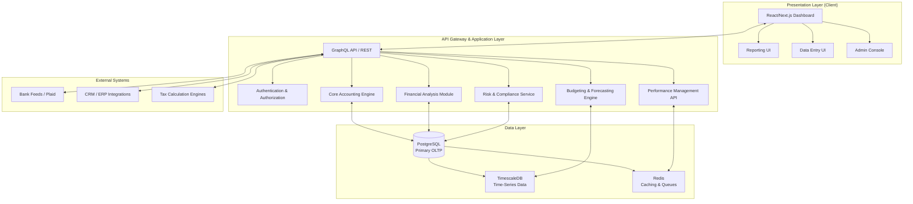

FinSight Pro — Enterprise Financial Analysis & Management System

https://img.shields.io/badge/Live%20Demo-FinSightPro-blue?style=for-the-badge

FinSight Pro is a conceptual, full-stack financial management SaaS platform designed from the ground up for scalability, compliance, and deep analytical insight. This document outlines the complete system architecture, database schema, module logic, and development roadmap as designed by a senior financial systems architect.

Table of Contents

1. System Architecture Overview
2. Database Schema Design
3. Module Breakdown & Responsibilities
4. Key Algorithms & Financial Logic
5. Example Financial Workflow
6. Suggested Tech Stack
7. Dashboard Design Structure
8. Future Expansion Roadmap

---

1. System Architecture Overview

The system follows a modern, API-first, modular monolithic (with clear domain boundaries) architecture, designed to be broken into microservices in the future.



· Presentation Layer: A dynamic dashboard (as seen in the live demo) built with React, fetching data via a unified API. It handles user input, data visualization, and report generation.
· Application Layer: An API Gateway that routes requests to domain-specific services. This layer contains all the core business logic, financial calculations, and orchestration. It enforces security and data validation.
· Data Layer: A combination of databases for different purposes: PostgreSQL for transactional integrity (ACID compliance), TimescaleDB for efficient time-series analysis (forecasts, trends), and Redis for high-speed caching and job queuing.
· Integration Layer: Secure connectors to external financial institutions (via Plaid-like services), CRMs, and other enterprise systems for automated data ingestion.

---

2. Database Schema Design

This is a simplified, core entity-relationship diagram focusing on the accounting engine.

```mermaid
erDiagram
    COMPANY ||--o{ ACCOUNT : has
    COMPANY ||--o{ JOURNAL_ENTRY : posts
    COMPANY ||--o{ BUDGET : defines
    ACCOUNT ||--o{ JOURNAL_LINE : "is debited/credited in"
    JOURNAL_ENTRY ||--o{ JOURNAL_LINE : contains
    JOURNAL_ENTRY }o--o{ APPROVAL_WORKFLOW : requires
    BUDGET ||--o{ BUDGET_LINE : contains
    BUDGET_LINE }o--|| ACCOUNT : "allocated to"
    COMPANY ||--o{ SCENARIO : models
    SCENARIO ||--o{ FORECAST : generates
    FORECAST }o--|| ACCOUNT : projects

    ACCOUNT {
        uuid id PK
        uuid company_id FK
        string account_code UK
        string name
        enum type "Asset, Liability, Equity, Revenue, Expense"
        enum subtype "Current, Non-Current, etc."
        string description
        boolean is_active
        timestamp created_at
    }

    JOURNAL_ENTRY {
        uuid id PK
        uuid company_id FK
        string entry_number UK
        date entry_date
        string description
        enum status "Draft, Approved, Posted"
        uuid approved_by FK
        timestamp posted_at
        timestamp created_at
    }

    JOURNAL_LINE {
        uuid id PK
        uuid journal_entry_id FK
        uuid account_id FK
        enum line_type "Debit, Credit"
        decimal amount (19,4)
        string memo
        jsonb custom_fields
    }

    BUDGET {
        uuid id PK
        uuid company_id FK
        string name "FY2024_Base"
        enum type "Operational, Capital"
        date fiscal_year_start
        date fiscal_year_end
        enum status "Draft, Active, Archived"
    }

    BUDGET_LINE {
        uuid id PK
        uuid budget_id FK
        uuid account_id FK
        integer period_month "1-12"
        decimal amount
    }

    SCENARIO {
        uuid id PK
        uuid company_id FK
        string name "Best Case"
        jsonb assumptions "GDP Growth, Interest Rate, etc."
    }

    FORECAST {
        uuid id PK
        uuid scenario_id FK
        uuid account_id FK
        date forecast_date
        decimal projected_amount
    }
```

Key Design Decisions:

· Double-Entry Enforcement: The JOURNAL_ENTRY and JOURNAL_LINE tables ensure every transaction has balanced debits and credits. Application logic will enforce that the sum of debits equals the sum of credits for a given journal_entry_id.
· Chart of Accounts: The ACCOUNT table uses a hierarchical account_code (e.g., 1010 for Cash, 1010-01 for Petty Cash) to allow for flexible reporting and consolidation. The type and subtype are crucial for automated financial statement generation.
· Scalability: Using UUIDs as primary keys prevents collisions in a distributed system. JSONB fields (custom_fields) allow for extensibility without schema changes.
· Time-Series Data: For high-volume forecasting and trend data, a separate time-series database (TimescaleDB) is used, which is optimized for FORECAST data and historical metric snapshots